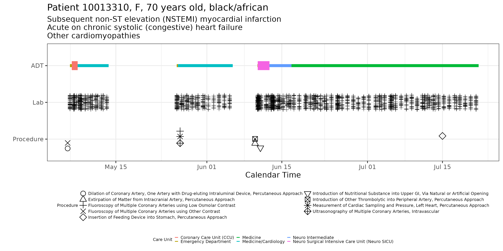

# Data Science with R

## Description
 - This repo was created to explore data science with R
 - The programs are developed in R studio and in the form of Quarto Markdowns

## HW1
- Utilized large dataset [MIMIC-IV v2.2](https://physionet.org/content/mimiciv/2.2/) (100+ GB, cohort of 80k records)
- Created symbolic link for ease of access of data across different machines
- Explored Bash scripting in Unix environments (Ubuntu)

## HW2
- Explored Apache Arrow, duckdb, and tidyverse for memory efficient ingestion

## HW3
- Built ICU cohort with patient ADT records and ICU stay information
- Cleaned data with filtering, selection and merging of data frames
- Created patient details visualization of overlayed plots with ggplot2

- Created patient vitals during different ICU stays over during of stay

- Created a finalized ICU cohort with multiple cleaned datasets

## HW4
-	Utilized cloud service (bigrquery) to eliminate memory stress on local machine
-	Utilized gtsummary to understand the data with numeric statistics
-	Utilized janitor package to speed up data cleaning and reformatting
-	Utilized R shiny to create a reactive app to visualize the mimic cohort

# HW5
-	Built Elastic Net, XGBoost, SVM, MLP and Ensemble model of mimic cohort
-	Compared performance and importance of features of the models
